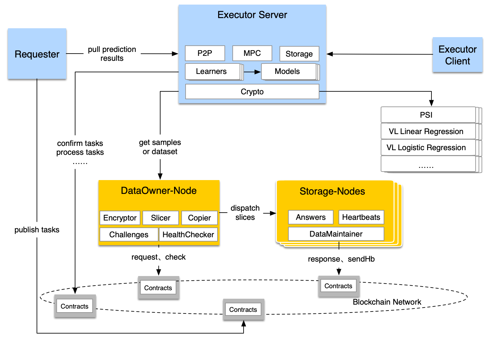

[DOC](https://paddledtx.readthedocs.io/zh_CN/latest) | [English](./README.md) | 中文

[](LICENSE)

# PaddleDTX
PaddleDTX，是一个基于**去中心化存储**的专注于**分布式机器学习**技术的解决方案，攻克海量隐私数据的安全存储问题，并且实现多方数据的安全交换，助其突破数据孤岛，共同建模，联合发挥数据的最大价值。

## 一、项目简介
PaddleDTX的计算层是由**计算需求节点**（Requester）、**任务执行节点**（Executor）以及**数据持有节点**（DataOwner）共同组建的网络。训练样本和预测数据集存储于由数据持有节点和**存储节点**（Storage）共同组建的去中心化存储网络。底层的区块链网络支撑计算层和去中心化存储网络。

### 1.1 多方安全计算网络
有预测需求的一方为计算需求节点。可获取样本数据进行模型训练和预测的一方为任务执行节点，多个任务执行节点组成一个SMPC（多方安全计算）网络。计算需求节点将任务发布到区块链网络，任务执行节点确认后执行任务。任务执行节点通过数据持有节点获取样本数据，同时，后者对数据做信任背书。

SMPC是一个支持多个学习过程并行运行的框架，会陆续集成更多纵向联邦学习、横向联邦学习算法。

### 1.2 去中心化存储网络
数据持有节点将自己的隐私数据进行加密、切分、副本复制后分发到存储节点，存储节点通过应答数据持有节点的挑战证明自己持有数据分片。通过这些机制，实现了在不泄漏隐私的前提下充分且安全地利用存储资源。更多原理和实现请参见 [XuperDB](./xdb/README_CN.md)。

### 1.3 区块链网络
训练任务和预测任务通过区块链网络广播到任务执行节点，后者继而执行训练任务和预测任务。数据持有节点和存储节点在副本保持证明、健康状态监控过程中，通过区块链网络实现信息交换。

目前，支持的底链技术为XuperChain。



## 二、纵向联邦学习
PaddleDTX 开源部分目前支持两方的纵向联邦学习算法，包括多元线性回归和多元逻辑回归。算法具体原理和实现参见 [crypto/ml](./crypto/core/machine_learning)，未来将支持更丰富的两方纵向联邦学习算法、多方的纵向联邦学习和横向联邦学习算法。

纵向联邦训练和预测步骤如下：


### 2.1 数据准备
计算任务会指定参与方的样本数据，数据存在去中心化存储系统(XuperDB)中。任务启动前，计算方（即数据持有方）需要从XuperDB获取自己的样本数据。

### 2.2 样本对齐
纵向的模型训练或预测任务，都需要对数据进行样本对齐，即：根据各自样本ID找到多个参与方的样本交集，用交集样本进行训练或预测。

项目采用了PSI（隐私求交）技术，可以在不泄露各方样本ID的前提下，实现样本求交的功能。PSI算法原理和实现详见 [crypto/psi](./crypto/core/machine_learning/linear_regression/gradient_descent/mpc_vertical/psi.go)。

### 2.3 训练过程
模型训练是多次迭代和交互的过程，依赖于两方数据的协同计算，需要双方不断传递中间参数来计算出各自的模型。

为保护样本数据的隐私，迭代过程的模型中间参数采用Paillier同态算法进行加密，Paillier支持密文加法和数乘操作。Paillier算法原理和实现详见 [crypto/paillier](./crypto/common/math/homomorphism/paillier/paillier.go)。

### 2.4 预测过程
预测任务需要指定模型，因此在预测任务启动前，指定的模型训练任务必须已经成功完成。模型分别存储在训练双方的本地，在预测时分别利用各自的模型进行计算，并汇总得到最终结果。

对于线性回归算法，预测结果汇总后需要进行逆标准化操作，这个操作只有拥有标签的那一方才能完成，因此需要将预测结果汇总到标签方，由标签方计算最终的预测结果，并将结果以文件的形式存到XuperDB中，供需求方获取。

## 三、安装
我们提供两种方式安装PaddleDTX，您可以根据自己的实际情况进行选择：

### 3.1 通过Docker安装
**强烈建议**您通过docker安装PaddleDTX。
您可以参考 [PaddleDTX镜像制作脚本](./dai/build_image.sh) 和 [XuperDB镜像制作脚本](./xdb/build_image.sh) 制作docker镜像，也可以使用我们提供的镜像构建系统，请参考 [docker-compose部署PaddleDTX](./testdata/README.md)。

### 3.2 源码安装
编译依赖

* go 1.13.x 及以上

```sh
# In dai directory
make

# In xdb directory 
make
```
您可以在`./output`中获取安装包，然后手动安装。

## 四、测试
我们提供了 [测试脚本](./scripts/README.md)方便您测试、了解和使用PaddleDTX。

## 五、参考资料
[1] Konečný J, McMahan H B, Yu F X, et al. Federated learning: Strategies for improving communication efficiency[J]. arXiv preprint arXiv:1610.05492, 2016.

[2] Yang Q, Liu Y, Chen T, et al. Federated machine learning: Concept and applications[J]. ACM Transactions on Intelligent Systems and Technology (TIST), 2019, 10(2): 1-19.

[3] Goodfellow I, Bengio Y, Courville A. Deep learning[M]. MIT press, 2016.

[4] Goodfellow I, Bengio Y, Courville A. Machine learning basics[J]. Deep learning, 2016, 1(7): 98-164.

[5] Paillier P. Public-key cryptosystems based on composite degree residuosity classes[C]//International conference on the theory and applications of cryptographic techniques. Springer, Berlin, Heidelberg, 1999: 223-238.

[6] Lo H K. Insecurity of quantum secure computations[J]. Physical Review A, 1997, 56(2): 1154.

[7] Chen H, Laine K, Rindal P. Fast private set intersection from homomorphic encryption[C]//Proceedings of the 2017 ACM SIGSAC Conference on Computer and Communications Security. 2017: 1243-1255.

[8] Shamir A. How to share a secret[J]. Communications of the ACM, 1979, 22(11): 612-613.

[9] https://xuper.baidu.com/n/xuperdoc/general_introduction/brief.html
