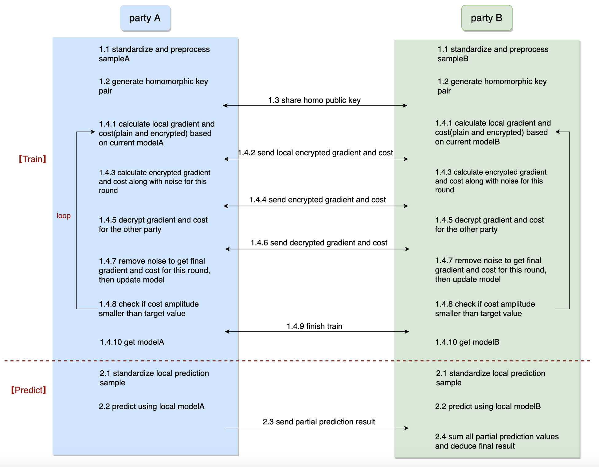

# PaddleDTX Crypto
Crypto 是 PaddleDTX 的密码学模块，实现了若干机器学习算法和对应的分布式改造。

目前开源了**纵向联邦学习**算法，包括**多元线性回归**和**多元逻辑回归**。同时支持秘密分享、不经意传输、加法同态加密、隐私求交等联邦学习依赖的工具。

## 一、机器学习算法
### 1.1 多元线性回归
多元线性回归用来描述一个变量受多个因素影响，且他们的关系可以用多元线性方程表示的场景。如房屋价格受房屋大小、楼层数、周边环境等因素影响。

线性回归的模型可以用如下表达式描述：

y = &theta;0 + &theta;1X1 + &theta;2X2 + ... + &theta;nXn

其中，目标特征值由n个变量乘以对应系数再加上常数项计算得到。学习过程就是通过迭代找到合适的系数，使得模型在训练集合的误差尽量小。

### 1.2 多元逻辑回归
不同于多元线性回归，多元逻辑回归的目标特征值是离散的，通常定义为{1,0}，分别表示目标特征是否为指定值。如利用鸢尾花卉数据集，可以训练模型来判断给定的样本是否为山鸢尾。

逻辑回归的模型可以用如下表达式描述（Sigmoid函数）：

y = 1 / (1 + e-&theta;X)

该模型是基于线性回归模型变化得到的，模型连续可导，且可以保证目标特征是(0,1)之间的数值，越接近1表明样本是指定值的概率越大。学习过程就是通过迭代找到合适的参数&theta;，使得模型在训练集合的误差尽量小。

## 二、纵向联邦学习算法
项目暂支持两方的纵向联邦学习算法，训练过程中，双方利用各自的样本数据计算部分梯度和损失，交换中间参数并进行整合，在保证不泄露隐私的前提下计算各自的模型。预测时利用各自模型计算部分预测值，并利用预测结果之和推导出最终预测结果。

训练和预测时，双方样本可能会有数量不一致的情况，需要根据各方数据ID对数据进行对齐，具体原理和实现详见[隐私求交](./core/machine_learning/linear_regression/gradient_descent/mpc_vertical/psi.go)。

多元线性回归和多元逻辑回归的纵向学习流程如下，假设已完成数据对齐：

### 2.1 训练过程
#### 2.1.1 样本标准化和预处理
样本标准化和预处理，是将各个特征的样本值变化锁定在固定范围的过程，提高模型的收敛速度，方便进行泛化计算。
尤其在数据集各个特征取值范围存在较大差异的情况下，最好使用标准化来对数据进行预处理。

#### 2.1.2 同态秘钥生成
纵向联邦学习过程的中间参数使用Paillier加法同态算法进行加密传输，并对密文直接进行同态计算。双方需各自生成同态公私钥对，并共享同态公钥。

#### 2.1.3 迭代过程
模型训练是一个通过不断迭代来寻找最优参数的过程，本项目采用梯度下降法进行模型参数迭代。

- **本地梯度和损失**：利用上一轮或者初始模型计算本地的部分梯度及损失值，并用己方同态公钥进行加密，共享给另一方；

- **加密梯度和损失**：整合对方加密梯度和损失值，以及己方明文梯度参数和损失值，计算用对方同态公钥加密的己方梯度和损失值，梯度和损失分别用随机数进行混淆；

- **解密梯度和损失**：解密对方的梯度和损失值，由于进行了随机混淆，解密过程不会泄露数据隐私；

- **还原梯度和损失**：各方将解密后的梯度及损失去除混淆值，得到最终的明文梯度和损失值，并更新本轮模型；

- **迭代结束判断**：该项目通过损失值振幅来判断模型是否收敛，当连续两轮的损失值的差值小于指定振幅时，结束迭代过程。

#### 2.1.4 泛化
机器学习的主要挑战是算法必须能在未观测到的新样本上表现良好，因此需要模型具有泛化能力。本项目支持L1(Lasso)和L2(Ridge)正则方式，具体实现详见[算法实现部分](./core/machine_learning)。

### 2.2 预测过程
#### 2.2.1 样本标准化
纵向联邦学习训练得到的模型是未经过逆标准化的模型，在预测时，各方需要先利用各自模型对己方预测样本进行标准化计算，才能正确使用模型。

#### 2.2.2 预测计算
各方利用本地模型和标准化的预测样本进行预测计算，得到部分预测结果。

#### 2.2.3 结果推导
参与方汇总预测结果，对预测结果进行求和，并根据具体学习算法推导出最终的预测结果。对于线性回归，预测结果需要进行逆标准化操作，该操作只有拥有标签的一方才有能力计算，因此通常将预测结果汇总到标签方。

## 三、使用示例
项目提供了完整的测试用例和步骤说明，具体测试代码和数据详见[机器学习测试](./test/ml)。
