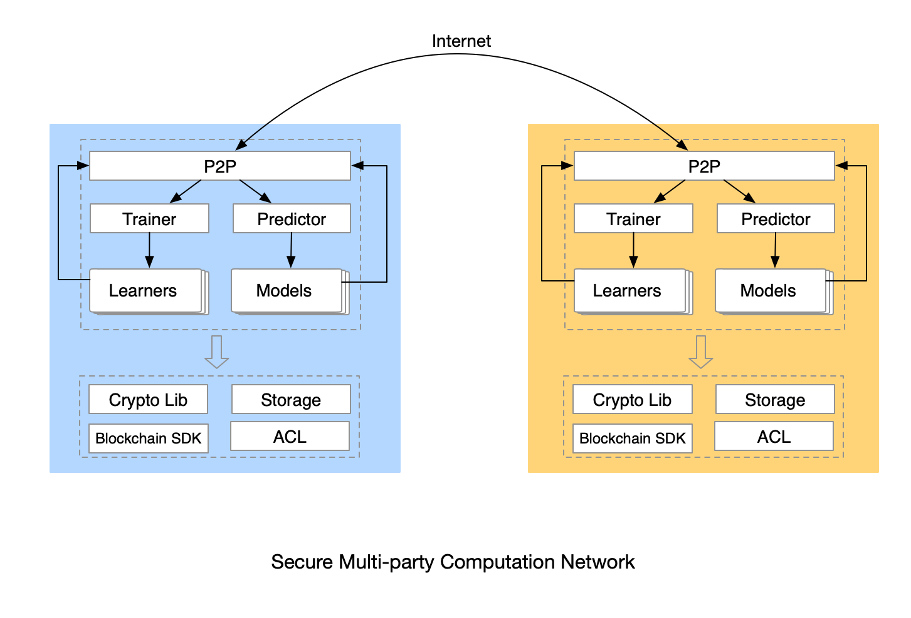

# Distributed AI
Distributed AI 是PaddleDTX的计算层。一方面，它实现了可信的多方安全计算网络（SMPC），支持多个学习过程并行运行。另一方面，作为一个可扩展框架，它可以持续集成多种联邦学习算法。

## 服务组件
Distributed AI 包含以下服务：
- Requester，计算需求节点，向区块链网络发布计算任务，从任务执行节点获取任务执行结果，并做可信性验证。
- Executor，任务执行节点，从区块链上获取要参与执行的任务，确认数据的使用权限后执行任务。做权限确认的过程也是数据持有节点对数据的可信性做背书的过程。

## 多方安全计算框架
PaddleDTX实现的多方安全计算框架，具备以下特征：
- 任务维度动态构建计算网络
- 支持多个学习过程并行执行
- 可扩展，方便集成各种联邦学习算法
- 以区块链、隐私计算、ACL技术为支撑，保证数据、模型的隐私性和可信性

## 可信联邦学习
PaddleDTX中，联邦学习分为训练过程和预测过程。计算需求方通过发布训练任务，任务执行节点会向数据持有节点做数据可信性背书，继而触发训练过程，最终得到满足条件的模型。如果有预测需求，计算需求方发布预测任务，任务执行节点会向数据持有节点做数据可信性背书，继而触发预测过程，最终得到预测结果。目前已集成的算法及其原理和实现，在 [crypto](./crypto.html#id2) 部分有更多体现。

## 接口与消息定义
[任务与相关接口定义](https://github.com/PaddlePaddle/PaddleDTX/tree/master/dai/protos/task)

[联邦学习过程接口定义](https://github.com/PaddlePaddle/PaddleDTX/tree/master/dai/protos/mpc/learners)

## 配置说明
[Requester配置](https://github.com/PaddlePaddle/PaddleDTX/blob/master/dai/conf/config-cli.toml)

[Executor配置](https://github.com/PaddlePaddle/PaddleDTX/blob/master/dai/conf/config.toml)

## 命令行工具
<a href="https://github.com/PaddlePaddle/PaddleDTX/blob/master/dai/requester/cmd/README.md">Requester命令使用说明</a>

<a href="https://github.com/PaddlePaddle/PaddleDTX/blob/master/dai/executor/cmd/README.md">Executor命令使用说明</a>