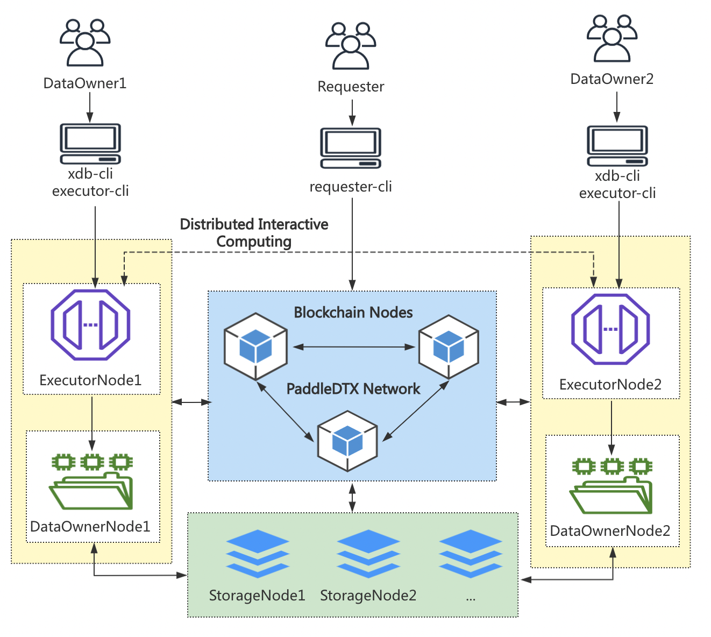

# 部署架构

PaddleDTX 主要由计算需求方、任务执行节点、数据持有节点、存储节点和区块链节点组成，部署架构如下图所示：

### 计算需求方(Requester)
计算需求方是机器学习模型或预测结果的需求方，需求方可能没有存储能力、没有数据资源和计算资源。需求方利用PaddleDTX网络中的资源，完成自己所需的计算并获得最终结果。

### 任务执行节点(Executor Node)
任务执行节点进行模型训练和预测任务的具体计算。在计算过程中，执行节点会自动向数据持有节点发起文件授权使用申请，只有数据持有节点确认授权，执行节点才拥有数据的使用权限，并利用授权的数据和计算资源参与多方计算。一个任务执行节点可向一个或多个数据持有节点发起数据使用申请。

### 数据持有节点(DataOwner Node)
数据持有节点是数据的归属方，可以为使用方做数据的可信性背书。数据持有节点通常将数据存储于远程节点，通过数据加密切分和分发、数据迁移、网络健康状态监控等机制，保障己方数据的私密性、安全性和高可用。

### 存储节点(Storage Node)
存储节点拥有丰富的存储资源，为数据持有方提供数据存储服务。存储节点通过健康状态更新、副本保持证明的挑战与应答等机制，证明自身的可靠性。

### 区块链节点(Blockchain Node)
区块链节点记录PaddleDTX网络中流转的关键信息，包括数据摘要、网络节点的去中心化治理、计算任务等信息，保证数据的安全可信。

从海量隐私数据存储到多方数据联合建模，PaddleDTX提供了全链路可信方案。在实际应用中，各方机构根据自身的需求和能力，部署某类服务节点，共建去中心化可信网络。
