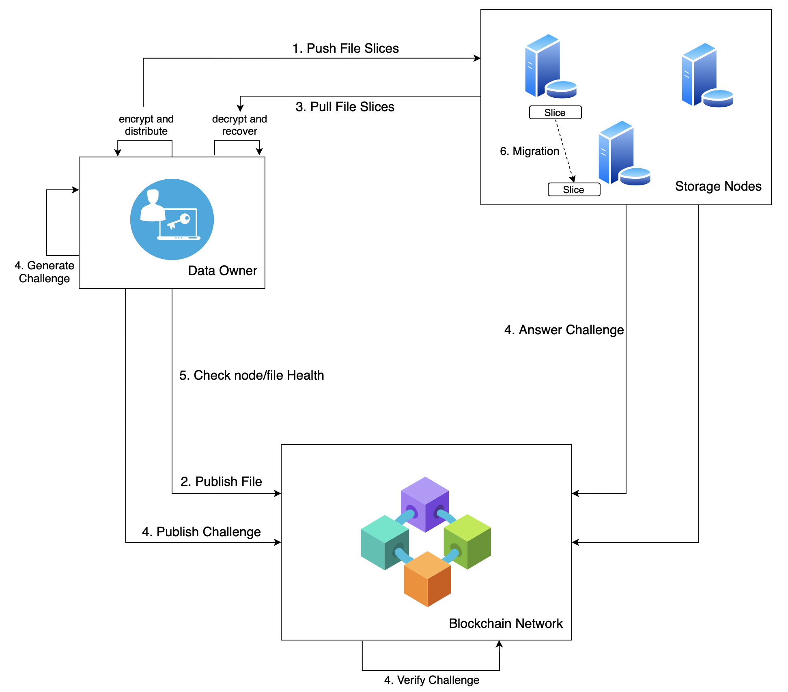

[中文](./README_CN.md) | English

# XuperDB
XuperDB is a decentralized storage system based on blockchain technology, focusing on solving the problem of secure storage of massive amounts of important, high-value, and private data.

## Project Description
Listed below are the features that distinguish XuperDB from other data storage systems, and we will continue to develop and optimize them.

- ***Secure storage***: private data is encrypted, segmented, and replicated and stored in a distributed manner, which not only prevents a single storage node from being attacked to cause data leakage, but also prevents multiple storage nodes from conspiring to obtain data.

- ***Efficient usage of storage resources and resistance to storage cheating***: nodes in the storage network are managed in a decentralized way, which is supported by the blockchain network and could make full use of idle storage resources and support unlimited data management. Resist cheating by storage nodes through replicas holding proof algorithm and challenge-answer-verify mechanism.

- ***Fault tolerance and automatic self-repair***: multi-copy replication and multi-machine storage make it possible to obtain storage data when some storage nodes suddenly go down. Furthermore, the health status of storage nodes is monitored, and data in dangerous nodes is migrated to healthy nodes in a timely manner.

- ***Resource access control***: realize decentralized data access control through blockchain technology and privacy computing technology.

Currently, XuperChain is the underlying blockchain framework of XuperDB, and Fabric is also supported.

### Architecture Overview
There are three types of nodes in XuperDB:  

- **DataOwner Nodes** are the owners of data and have storage requirements. A DataOwner node encrypts, splits, and makes copies of its private data and distributes them to storage nodes.
- **Storage Nodes** have a wealth of idle storage resources and could provide storage services. A Storage node proves that it honestly holds the data fragments by answering the challenges generated by the DataOwner.
- **Blockchain Nodes** form a Blockchain Network, which supports the decentralized management of the entire storage network. The DataOwner node and the Storage node exchange information through the blockchain network when monitoring files and nodes health status, and also in the challenge-answer-verify process of PoRH.

In [PaddleDTX](../README.md), the network structure is expanded, adding:
- **Executor Nodes** are responsible for the federated learning calculation process.




### Encrypted Slice Generation
The DataOwner node encrypts, slices, replicates, and randomly groups the private data, and then encrypts the fragments for different Storage nodes to generate encrypted slices, and distributes them to different Storage nodes. Using those series of measures ensures that those slice groups stored by each node are different, and makes it impossible to reuse a PoRH between Storage nodes, thereby resisting single copy attacks. Multiple copies and multiple storage make the system have CFT(Crash Fault Tolerance) and self-healing capabilities. The attacker can't obtain the plaintext of the data through the Storage node, and the conspiracy of multiple Storage nodes to obtain the data also requires a huge cost. Please refer to [slicer](./engine/slicer/README_cn.md), [copier](./engine/copier/README_cn.md) and [encryptor](./engine/encryptor/README_cn.md) for more about implementation.

### Proof of Replication Holding
The mechanism to resist storage cheating can be briefly described as: the DataOwner node issues a challenge to the blockchain network, the Storage node involved submits a proof to the blockchain network to answer the challenge, and the smart contract automatically verifies the response information. If it passes, the Storage node can be proved that it holds the data slice.

[PoRH](./engine/challenger/README_cn.md)(Proof of Replication Holding) is the core of the mechanism. XuperDB implements two kinds of PoRH:
- [Pairing-based PoRH](../crypto/core/pdp/pairing)
- [MerkleTree-based PoRH](../crypto/core/pdp/merkle)

## Installation
XuperDB contains:
- **xdb** is a server of DataOwner or Storage
- **xdb-cli** is a command line tool for DataOwner or Storage

There are two ways of installing XuperDB:
### Run XuperDB in docker
We **highly recommend** to run XuperDB in Docker.
You could install all the components with docker images provided by us. Please refer to [deployment with docker-compose](./testdata/README.md). If you want to build docker images locally, please refer to [building image of XuperDB](./build_image.sh).

### Install XuperDB from source code
To build XuperDB from source code, you need:

* go 1.13 or greater

```sh
# In xdb directory 
make
```
You could get installation package from `./output` and install it manually.

## Testing
We provide [test scripts](./scripts/README.md) for you to test, understand and use XuperDB.